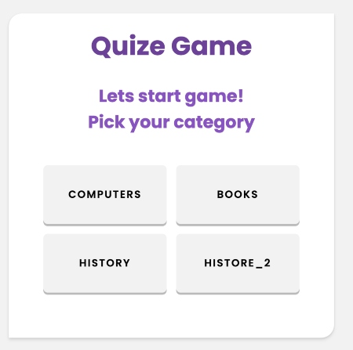
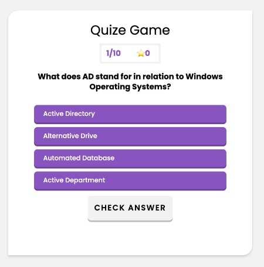
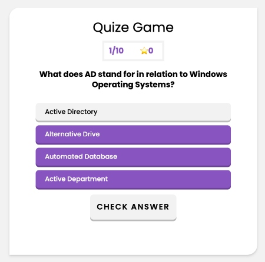
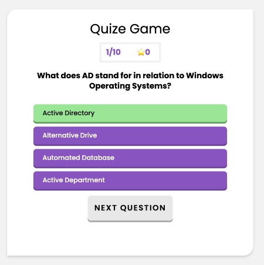
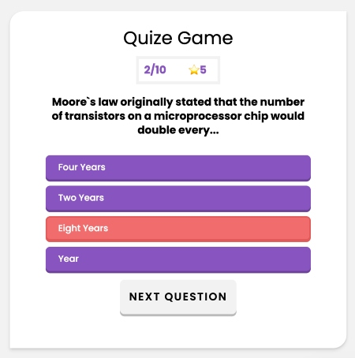
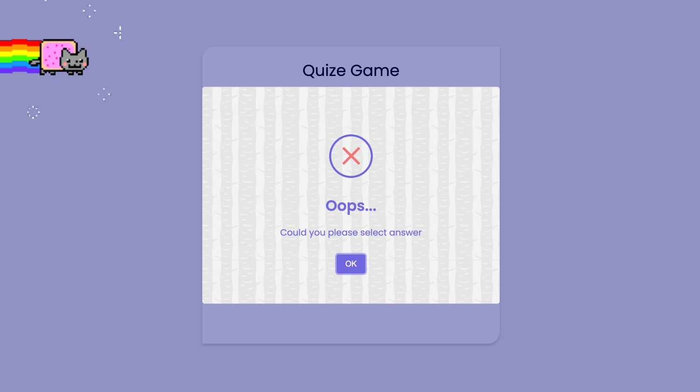
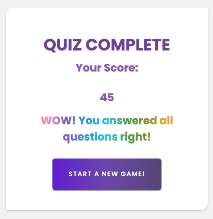
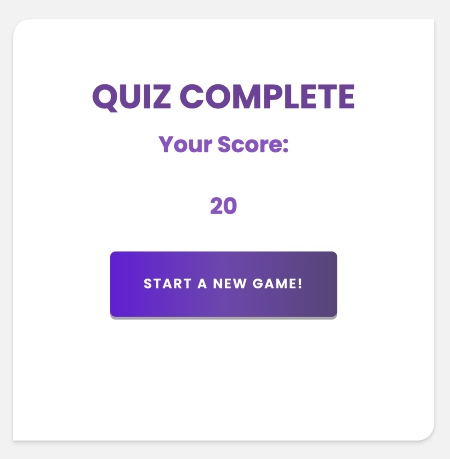

# Trivia Game.

## Table of Contents

<details>
<summary><b>(click to expand)</b></summary>
<!-- MarkdownTOC -->
  
1. [Live demo](#liveDemo)
1. [Project Description](#description)
1. [Benefits of playing trivia and quiz games](#benefits)
1. [Technology](#technology)  
1. [Technical Requirements](#technicalRequirements)
1. [Additional resources](#resources) 
1. [Getting Started](#gettingStarted)
1. [Future Features](#futureFeatures)

<!-- /MarkdownTOC -->
</details>

<a id="liveDemo"></a>

# Live demo:

https://annadruzhinina.github.io/Trivia-Game-UI/

<a id="description"></a>

## Project Description:

This is a front-end web application developed as my first personal project while studying at General
Assembly.

Trivia is a type of game in which players are asked questions about different topics and they have to get as many correct answers as possible. Trivia contests are usually organized as part of events, parties and as pub entertainment. Normally contestants are organized in teams and the team who gets the higher score wins.

<a id="benefits"></a>

## Benefits of playing trivia and quiz games:

Unfortunately every year we grow a bit older and we realize that our mind is not as sharp and fast as it used to be. If we don’t train our brain, it gets harder for us to remember, concentrate and learn new skills and information.
Quiz questions can help prevent this process to go so fast as it serves as a form of exercise for our brain.

<a id="technology"></a>

## Technology:

- JavaScript
- HTML/CSS

<a id="technicalRequirements"></a>

## Technical requirements

- Render app in browser. Hosted on github pages;
- Include seperate HTML/CSS/JavaScript files;
- Use JavaScript for DOM manipulation;
- Use semantic, valid markup for HTML and CSS (must pass validation without errors);
- Have properly indented HTML, CSS & JavaScript. In addition, vertical whitespace needs to be consistent;
- No remaining dead and/or commented out code (code that will never be called);
- Have functions and variables that are named sensibly. Remember, functions are typically named as verbs, and variables (data) are named as nouns;

<a id="resources"></a>

## Additional resources:

### 1. Customizable JavaScript popup boxes

### A beautiful, responsive, customizable accessibility (WAI-ARIA) replacement for JavaScript popup boxes.

> [https://sweetalert2.github.io/#frameworks-integrations](https://sweetalert2.github.io/#frameworks-integrations)

### Download & Install

This:

> ```bash
> npm install sweetalert2
> ```

### Or grab from: [jsdelivr CDN](https://www.jsdelivr.com/package/npm/sweetalert2) ;

This:

> ```bash
> <script src="//cdn.jsdelivr.net/npm/sweetalert2@11"></script>
> ```

### 2. Make a set of questions

### Generate Trivia questions:

> [https://opentdb.com/api_config.php](https://opentdb.com/api_config.php);

### JSON Pretty Print:

> [https://jsonformatter.org/json-pretty-print](https://jsonformatter.org/json-pretty-print);

<a id="gettingStarted"></a>

## Getting Started:

### 1. Choose category;

<p align="center" width="100%">
    <br>
     
</p>
<br>
<!-- <br> -->

### 2. Display random questions from the question set;<br>

<p align="center" width="100%">
    <br>
     
</p>
<br>

### 3. Pick one answer (the button's background is changed to grey color ) and click on the "Check Answer" button:<br>

<p align="center" width="100%">
    <br>
     
</p>
<br>

#### - if the answer is correct: the button's background is changed to green color, starScore update +5, question +1/10, and appear button "Next Question";<br>

<p align="center" width="100%">
    <br>
     
</p>
<br>

#### - if the answer is incorrect: the button's background is changed to red color, starScore dosen't update, question +1/10, and appear button "Next Question";<br>

<p align="center" width="100%">
    <br>
     
</p>

<br>

### 4. User didn't choose any answer:

<p align="center" width="100%">
    <br>
     
</p>
<br>

### 5. Final screen:<br>

#### - if user answered all questions right:

<p align="center" width="100%">
    <br>
     
</p>
<br>

#### - if user didn't answered all questions right:<br>

<p align="center" width="100%">
    <br>
     
</p>
<br>

<a id="futureFeatures"></a>

## Future Features:

1. Make this app a team game as well;
2. Add timer;
3. If the player selects the correct answer, show a screen congratulating them for choosing the right option. After a few seconds, display the next question -- do this without user input;
4. Display page where users can see:

- the teams or individual score depends which tipe of game was selected at the begining;
- the time that each team(user) spent on the game;
- correct and incorrect answers by team(user);

5. Calculate the winning score using each team's total score and time spent.
